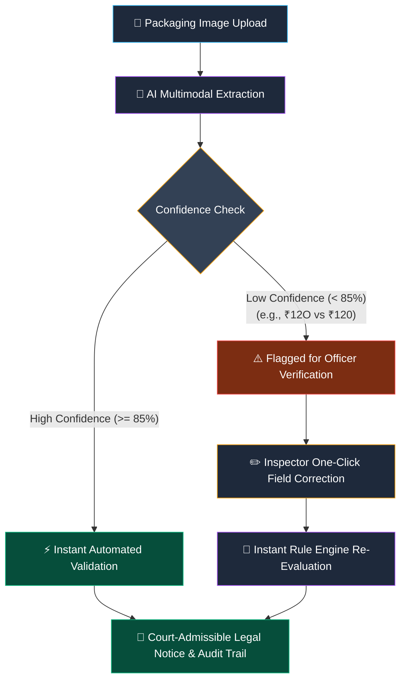

# METROLOGY-AI: Simplified & Beautiful Workflow Diagrams

---

### 🌟 1. Primary End-to-End System Workflow (Clean 5-Stage Architecture)

```mermaid
flowchart LR
    %% STAGE 1: INPUT
    subgraph S1["1. SMART CAPTURE"]
        A1["📸 Multi-Face Packaging<br/>(Front, Back, Sides)"]
        A2["🌐 E-Commerce URL<br/>(Amazon, Quick-Commerce)"]
        A3["🏷️ GS1 Barcode / QR"]
    end

    %% STAGE 2: AI VISION
    subgraph S2["2. AI VISION & OCR"]
        B1["✨ Image Quality Pre-Check<br/>(Blur & Glare Analysis)"]
        B2["🧠 Deep Learning OCR<br/>(EasyOCR + Vision AI)"]
        B3["📋 Structured Fields<br/>(MRP, USP, Net Qty, Dates)"]
    end

    %% STAGE 3: RULE ENGINE
    subgraph S3["3. LEGAL RULE ENGINE"]
        C1["⚖️ LMPC Rules, 2011<br/>(Rule 5, 6, 7 & 6(10))"]
        C2["🔍 Violation Detector<br/>(Omissions, Units, Font Size)"]
    end

    %% STAGE 4: TRIAGE & HITL
    subgraph S4["4. INTELLIGENT TRIAGE"]
        D1{"AI Confidence<br/>>= 85%?"}
        D2["👤 Inspector HITL Review<br/>(1-Click Verification)"]
        D3["📊 Priority Risk Score (PRI)<br/>(Brand Risk + Severity)"]
    end

    %% STAGE 5: ENFORCEMENT
    subgraph S5["5. ACTION & ENFORCEMENT"]
        E1["📜 Section 36 Legal Notice<br/>(Court-Admissible PDF)"]
        E2["🛡️ Citizen INGRAM Grievance<br/>(National Consumer Helpline)"]
        E3["🔐 SHA-256 Audit Ledger<br/>(Tamper-Proof Record)"]
    end

    %% Flow Connections
    A1 & A2 & A3 --> B1
    B1 --> B2 --> B3
    B3 --> C1 --> C2
    C2 --> D1
    D1 -- "Low Confidence" --> D2
    D1 -- "High Confidence" --> D3
    D2 --> D3
    D3 --> E1 & E2 & E3

    %% Custom Modern Palette
    style S1 fill:#0f172a,stroke:#38bdf8,stroke-width:2px,color:#f8fafc
    style S2 fill:#0f172a,stroke:#a855f7,stroke-width:2px,color:#f8fafc
    style S3 fill:#0f172a,stroke:#f59e0b,stroke-width:2px,color:#f8fafc
    style S4 fill:#0f172a,stroke:#ec4899,stroke-width:2px,color:#f8fafc
    style S5 fill:#0f172a,stroke:#10b981,stroke-width:2px,color:#f8fafc

    style A1 fill:#1e293b,stroke:#38bdf8,color:#e2e8f0
    style A2 fill:#1e293b,stroke:#38bdf8,color:#e2e8f0
    style A3 fill:#1e293b,stroke:#38bdf8,color:#e2e8f0
    style B1 fill:#1e293b,stroke:#a855f7,color:#e2e8f0
    style B2 fill:#1e293b,stroke:#a855f7,color:#e2e8f0
    style B3 fill:#1e293b,stroke:#a855f7,color:#e2e8f0
    style C1 fill:#1e293b,stroke:#f59e0b,color:#e2e8f0
    style C2 fill:#1e293b,stroke:#f59e0b,color:#e2e8f0
    style D1 fill:#334155,stroke:#ec4899,color:#f8fafc
    style D2 fill:#7c2d12,stroke:#f87171,color:#fef2f2
    style D3 fill:#1e293b,stroke:#ec4899,color:#e2e8f0
    style E1 fill:#064e3b,stroke:#34d399,color:#f0fdf4
    style E2 fill:#1e293b,stroke:#10b981,color:#e2e8f0
    style E3 fill:#1e293b,stroke:#10b981,color:#e2e8f0
```

---

### 🛡️ 2. Simplified "AI Confidence + Human-in-the-Loop" Verification Flow

